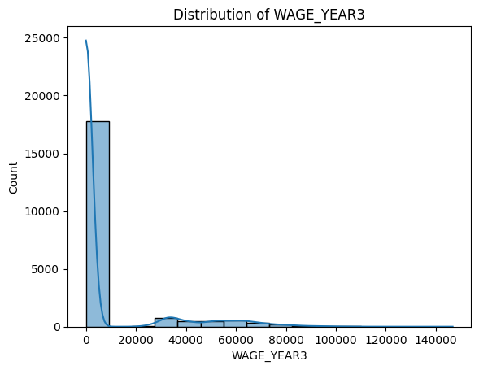

# x62-data-challenge-student-pathways

# Data Exploration Report

This document answers the questions required in the assignment.

---

## Data Quality
- **Data types:** Mixed — categorical (object) and numeric (float64)
- **Missing values:** Yes, `DISTRICT_CODE` contain missing values.
- **Numeric columns:** `DISTRICT_CODE`, `WAGE_YEAR1`, `WAGE_YEAR2`, `WAGE_YEAR3`, `WAGE_YEAR4`
- **Categorical columns:** `DISTRICT_TYPE`, `DISTRICT_NAME`, `ACADEMIC_YEAR`, `DEMO_CATEGORY`, `STUDENT_POPULATION`, `AWARD_CATEGORY`

---

## Range and Distribution
- **Unique categorical values:**  
  - `DISTRICT_TYPE`: 3 unique values (`School District`, `Legislative District`, `All`)  
  - `DISTRICT_NAME`: 692 unique values and 10 of them are (`Duarte Unified`, `Coronado Unified`, `Gilroy Unified`, `Pleasant Valley`, `Senate District 15`, `Adelanto Elementary`, `Assembly District 56`, `Klamath-Trinity Joint Unified`, `Modoc Joint Unified`, `Healdsburg Unified`)
  - `ACADEMIC_YEAR`: 1 unique value
  - `DEMO_CATEGORY`: 5 unique values (`Race`, `Homeless Status`, `All`, `Foster Status`, `Gender`) 
  - `STUDENT_POPULATION`: 15 unique values and 10 of them are (`None Reported`, `Black or African American`, `Did Not Experience Homelessness in K-12`, `American Indian or Alaska Native`, `Native Hawaiian or Other Pacific Islander`, `All`, `Two or More Races`, `Foster Youth`, `Female`, `White`) 
  - `AWARD_CATEGORY`: 4 unique values (`Bachelor's Degree - Did Not Transfer`, `Associate Degree`, `Community College Certificate`, `Bachelor's Degree - Transferred`)
- **Range of numeric columns:** Wages typically between `0` and `~153910`,

- **Distribution:** Wages are **right-skewed** (most districts earn lower wages)

---

### Column Meanings
- **DISTRICT_TYPE** — Indicates the type of district.  
- **DISTRICT_NAME** — The name of the district or administrative unit.  
- **ACADEMIC_YEAR** — The academic year the data refer to (e.g., *2018–2019*).  
- **DEMO_CATEGORY** — The demographic classification used for grouping students.  
- **STUDENT_POPULATION** — The specific subgroup of students within each demographic category.  
- **AWARD_CATEGORY** — The type of degree or certificate awarded.

---

## Relationships Between Columns
- **DISTRICT_TYPE → DISTRICT_NAME** Each district name belongs to a specific district type.
- **WAGE_YEAR1 → WAGE_YEAR2 → WAGE_YEAR3 → WAGE_YEAR4** They are **strongly and positively correlated** with each other (correlation ≈ 0.98–0.99)
- **Wage–District Interaction** Some moderate positive and negative correlations appear between **wage variables** and **district types**. This may suggest that certain district types tend to be associated with **higher or lower wage levels**. 

---

## CS 562 Specific Questions
- **Highest WAGE_YEAR3 demographic:** appears in the **All** category  
- **Lowest WAGE_YEAR3 demographic:** appears in the **Race** category

- **People with negative wage trends:** None, all demographics show positive wage growth between Year 1 and Year 4  
- **People with positive wage trends:** Gender demographic
